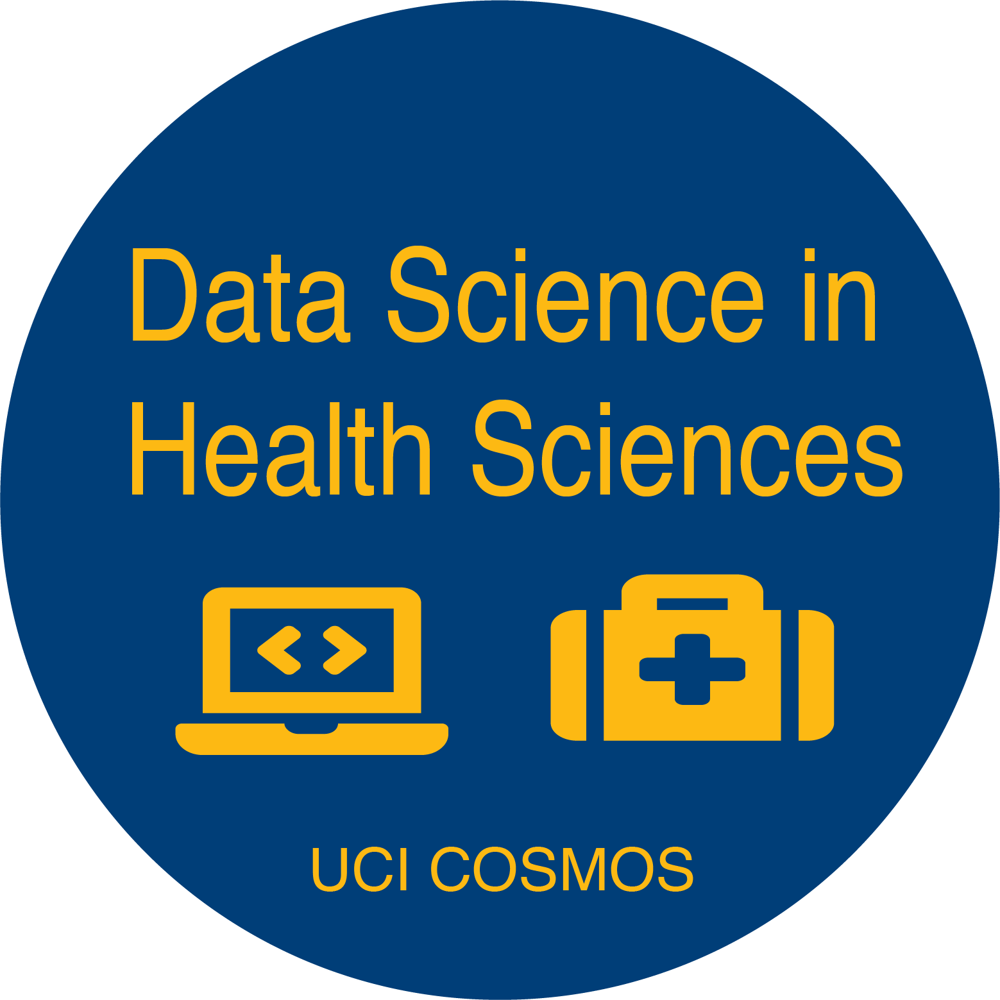

 

## Data Science in Health Sciences
### University of California 
#### The California State Summer School for Mathematics and Science

Summer 2021 

[Dr. Mine Dogucu](https://minedogucu.com)  
[Dr. Babak Shahbaba](https://www.ics.uci.edu/~babaks/)

This repo contains the source code for the program website as well as the program materials such as slides and assignments.

The program materials are licensed under [Creative Commons Attribution-NonCommercial-ShareAlike 4.0 International License](http://creativecommons.org/licenses/by-nc-sa/4.0/).

