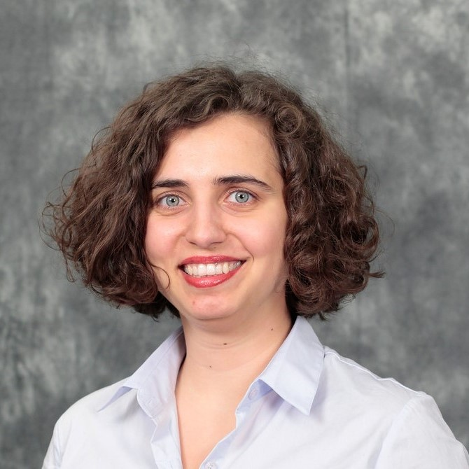
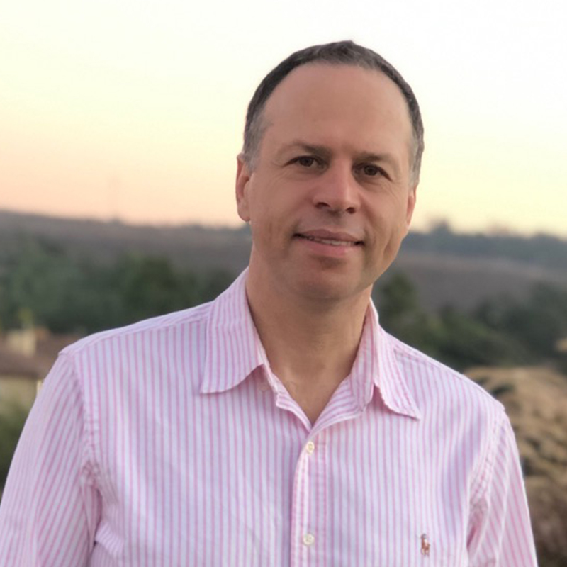
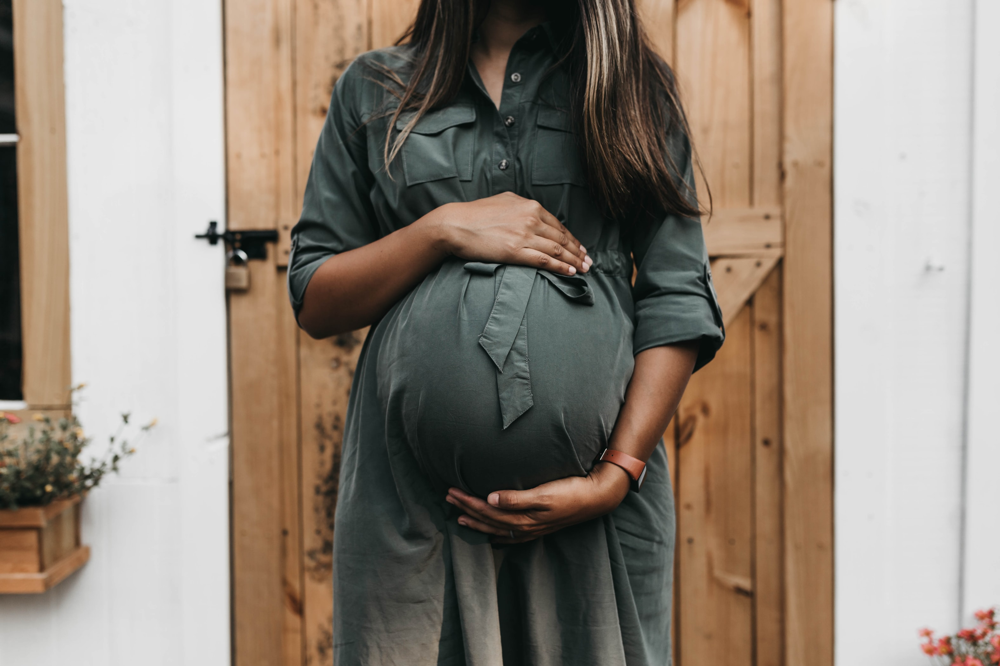
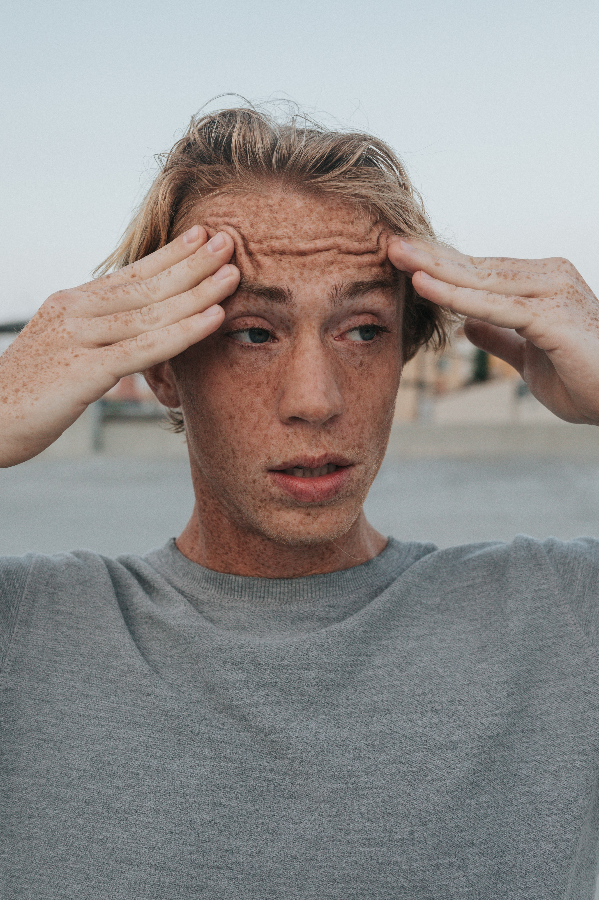
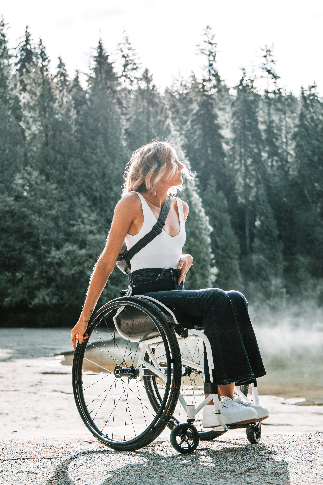
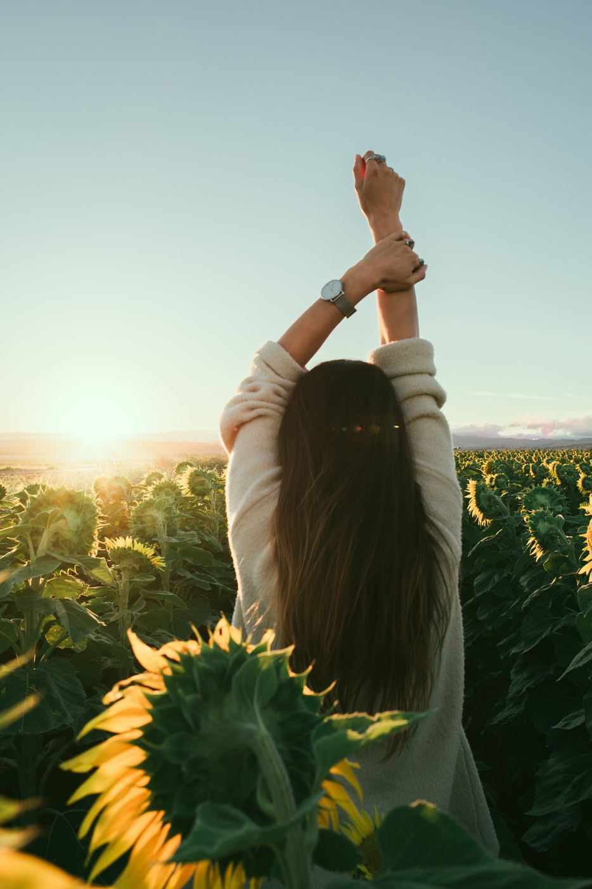
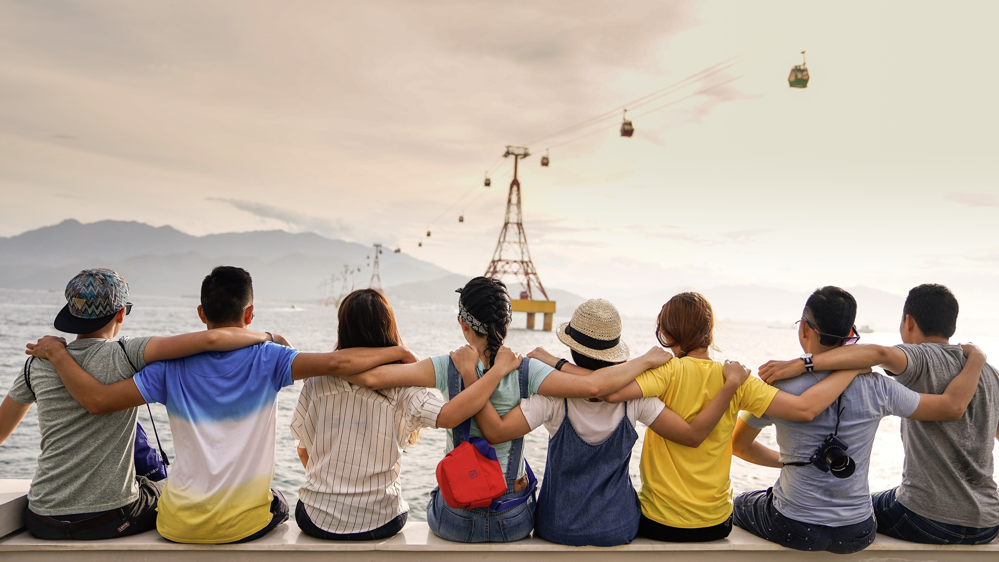
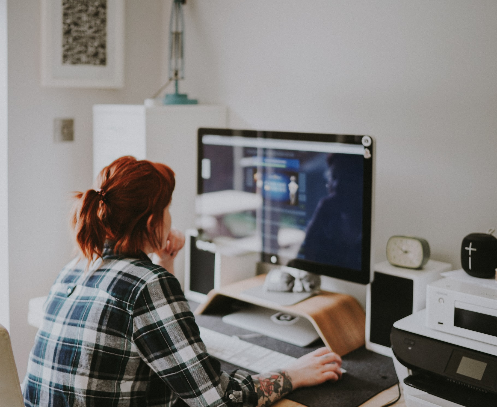
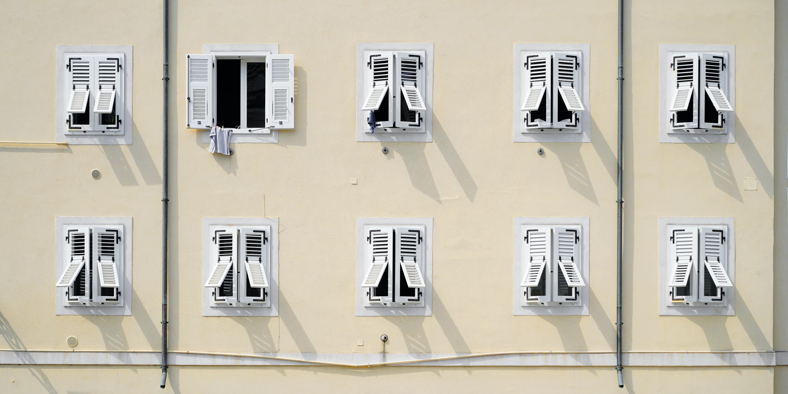
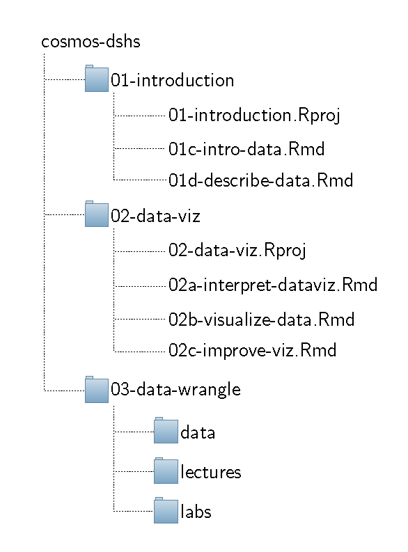

class: title-slide


<br>
<br>
.right-panel[ 
<br>

# `r rmarkdown::metadata$title`

## `r rmarkdown::metadata$author`

]

---

class: center middle

## Dr. Dogucu


```{r echo=FALSE, fig.align='center', out.width="30%"}

```


---

class: center middle

## Dr. Shahbaba


```{r echo=FALSE, fig.align='center', out.width="30%"}

```


---

class: center middle

## Alicia

```{r echo=FALSE, fig.align='center', out.width="30%"}
knitr::include_graphics("img/becerra-romero.png")
```

---

class: center middle

## Kyle

```{r echo=FALSE, fig.align='center', out.width="30%"}
knitr::include_graphics("img/conniff.jpg")
```

---

class: center middle

## Thabat

```{r echo=FALSE, fig.align='center', out.width="30%"}
knitr::include_graphics("img/dahdoul.jpeg")
```

---

class: middle class

## Getting to Know Each Other

- Name
- Pronoun
- Location 
- Grade
- Interests
- Pets
- Fun fact


---

class: inverse middle center

.font150[Content]

---

class: middle 

![:col_header 
  <i class="fas fa-square-root-alt" aria-hidden="true" style="font-size:90px;"></i>,
  <i class="fas fa-laptop-code" aria-hidden="true" style="font-size:90px;"></i>,
  <i class="fas fa-stethoscope" aria-hidden="true" style="font-size:90px;"></i>
              ]

---

class:middle center

| Time        | Topics |Instructor |
|-------------|--------|----|
| Week 1      |Exploring Data | Dr. Dogucu
| Week 2      |Probability and Inference        | Dr. Shahbaba
| Week 3      |Statistical Modeling        | Dr. Shahbaba
| Week 4      |Communicating Statistical Findings        | Dr. Dogucu


---

class: middle center

## Projects

```{r echo=FALSE, out.width="50%"}

```

---

class:middle center


| Time        | Topics |
|-------------|--------|
| 1st weekend |        |
| 2nd weekend |Derive research questions for the projects individually        |
| 3rd weekend |Explore the projects dataset in groups        |
| 4th weekend |Present findings of the project        |


---

class: inverse middle center

.font150[ Policies ]

---

class: middle 

## Learning Environment

This is an inclusive learning environment where everyone is
- welcome;
- expected to respect each other; and
- expected to comply to the UC Irvine as well as COSMOS rules and regulations.


---

class: middle

## Attendance and Participation

You are expected to attend all activities of the COSMOS program and actively participate.
Please arrive on time.

---

class: middle center

```{r echo=FALSE, fig.align='center', out.width="30%"}

```

Keep your webcam on unless we are on a break. 

---


class: inverse middle center

.font100[ Recommendations ]

---

class: center middle


```{r echo=FALSE, out.width="30%"}

```


Ask questions!   
  

---

class:center
Don't compare yourself to others.
```{r echo=FALSE,fig.align='center'}
tweetrmd::tweet_screenshot(
  tweetrmd::tweet_url("thephysicsgirl", "1410846326976225285"),
  hide_media = FALSE,
  theme = "dark",
  maxwidth = 270,
)
```

---

class: middle center

Move your body, stretch, go out (if it is safe) during breaks.

.pull-left[



]

.float-right[





]


---

class: middle center

```{r echo=FALSE, fig.align='center', out.width="70%"}

```

Data science is a collaborative process and it is much more fun and easier when data scientists are kind to one another and support each other.

---

class: middle center

```{r echo=FALSE, fig.align='center', out.width="50%"}

```

When we lecture, watch and listen to us carefully. We will dedicate time for you to try everything yourself. 

---

class: middle center

```{r echo=FALSE, fig.align='center', out.width="60%"}

```

Take half an hour at the end of each day to review the materials and your notes (cheat sheets).


---

class: middle center

Do not open too many windows on your computers. Keep e-mail, social media, messaging apps especially turned off. For each session we will tell you what apps/files you will need.

```{r echo=FALSE, fig.align='center', out.width="60%"}

```

---

class: middle 

.pull-left[

Keep your files organized.   

We use numbers (e.g. `01`, `02`) to indicate the day of the program.  

We use letters (e.g. `a`, `b`) to indicate the sequence of lectures/labs in a given day.

]

.pull-right[

```{r echo=FALSE, out.width="70%", fig.align="center"}

```

]


