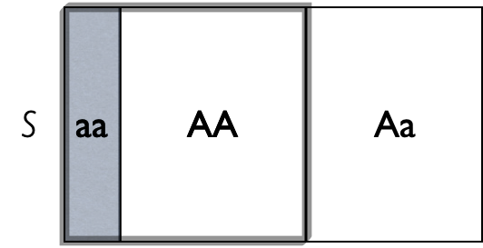

class: title-slide

```{r echo = FALSE}
library(fabricerin)
```

<br>
<br>
.right-panel[ 
<br>

# `r rmarkdown::metadata$title`

## `r rmarkdown::metadata$author`

]

---

## Introduction
 - We have used plots and summary statistics to learn about the distribution of variables and to investigate their relationships. 
 
 - We now want to generalize our findings to the population. 
 
 - However, we almost always remain uncertain about the true distributions and relationships in the population.
 
 - Therefore, when we generalize our findings from a sample to the whole population, we should explicitly specify the extent of our uncertainty.  
 
 - We now discuss probability as a measure of uncertainty.
 
 - We use some examples from genetics.  
 
---
 
## Some Commonly Used Genetic Terms
 
- Gene

- Single Nucleotide Polymorphisms (SNPs)

- Alleles

- Genotype

- Homozygous vs. heterozygous

- Phenotype

- Recessive vs. dominant

---

## Random phenomena and their sample space

- A phenomenon is called random if its outcome (value) cannot be determined with certainty before it occurs. 

- For example, coin tossing and genotypes  are random phenomena.

- The collection of all possible outcomes $S$ is called the sample space. 

  - Coin tossing: S=\{H, T\} 
  - Die rolling: S=\{1, 2, 3, 4, 5, 6\} 
  - Bi-allelic gene: S=\{A, a\} 
  - Genotype: S=\{AA, Aa, aa\}

---

## Probability

- To each possible outcome in the sample space, we assign a probability
$P$, which represents how certain we are about the occurrence of the corresponding outcome. 

- For an outcome $o$, we denote the probability as $P(o)$, where $0 \le P(o) \le 1$. 

- The total probability of all outcomes in the sample space is always 1.

  - Coin tossing: P(H)+ P(T)=1
  - Die rolling:  P(1)+P(2)+P(3)+P(4)+P(5)+P(6) = 1.

- Therefore, if the outcomes are equally probable, the probability of
each outcome is $1/n_{S}$, where $n_{S}$ is the number of possible
outcomes.
  
---

## Random events

- An {event} is a subset of the sample space $S$. 

- A possible event for die rolling is $E = \{1, 3, 5\}$. This is the event of rolling an
odd number. 

- For the genotype example, $E=\{\mathit{AA}, \mathit{aa}\}$
is the event that a person is homozygous.

- An event occurs when any outcome within that event occurs. 

- We denote the probability of event $E$ as $P(E)$.
 
- The probability of an event is the sum of the probabilities for all
individual outcomes included in that event.

---

## Example

- As a running example, we consider a bi-allelic gene A with
two alleles $A$ and $a$. 
- We assume that allele $a$ is recessive and
causes a specific disease. 
- Then only people with the genotype
$\mathit{aa}$ have the disease. 

```{r, echo=FALSE,out.width='25%',fig.align='center'}

```

---

## Example

- We can define four events as follows:

$$
\begin{array}{l@{\quad}l}
\mbox{The homozygous event:} & HM    = \{\mathit{AA}, \mathit{aa}\}, \\
\mbox{The heterozygous event:} & HT  = \{\mathit{Aa}\},  \\  
\mbox{The no-disease event:} & ND   = \{\mathit{AA}, \mathit{Aa}\}, \\
\mbox{The disease event:} & D   = \{\mathit{aa}\} .
\end{array}
$$